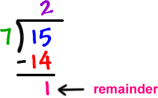
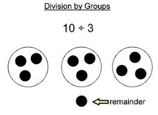

Worked Example 1A:(basic knowledge)
===================================

Three things students get wrong

* 5/3 (int divided by int)
* 5 % 3 mod (divide vs. mod)
* 3 % 5 (remainder when division is 0)

   

.. topic:: Subgoal Labels

    Evaluate an assignment statement
    
    1. Determine whether data type of expression is compatible with data type of variable  
    2. Update variable for pre based on side effect
    3. Solve arithmetic equation
    4. Check data type of copied value against data type of variable
    5. Update variable for post based on side effect

Assume the following given declarations:

.. code-block:: cpp

    int alpha = 2,
    beta = 1, delta = 3, 
    eta, gamma;
    double omega = 2.5, 
    theta = -1.3, kappa = 3.0, lambda, rho; 
         
         

   
Evaluate this statement.If invalid, give the reason. If valid, what value is assigned to the variable? Note any possible side effects.

      
.. code-block:: cpp
   
    lambda=alpha + delta;
   

    

.. topic:: SG1
   
   **Determine whether data type of expression is compatible with data type of variable**  
   
   .. code-block:: cpp

      lambda = alpha + delta;
            
   **Is the identifier on the lefthand side of the assignment statement a variable? What data type is it?**
        
        
         .. reveal:: revsga2
            :showtitle: Show answer
            
             lambda is declared as a double
           
   **Look at the righthand side of the assignment statement and determine the resultant data type.**
   
     .. reveal:: revsga3
            :showtitle: Show answer
        
   
            alpha + delta is evaluated as: int + int which is: int
            
   **Can the data type of the righthand side be assigned to the data type on the lefthand side?**
   
     .. reveal:: revsga4
            :showtitle: Show answer
           
            
            Yes, an int can be assigned to a double (automatic promotion by adding “.0” to value);
   

.. topic:: SG2: Update variables for any pre-increment or pre-decrement operators (side effects)

    NOT USED IN THIS EXAMPLE

.. topic:: SG3: Solve arithmetic equation

   **Given**
   
     .. code-block:: cpp
     
        int alpha = 2, delta = 3;
        double lambda;
        lambda = alpha + delta ;

    - lambda = alpha + delta;
      Replacing the variables with their values, you get:
      
      lambda = 2 + 3 = 5 (converted to 5.0)

.. topic:: SG4: Check data type of copied value against data type of variable

   **Given**
   
     .. code-block:: cpp
     
        int alpha = 2, delta = 3;
        double lambda;
        lambda = alpha + delta ;

   .. reveal:: revsga5
      :showtitle: Show answer
      
             
        Yes, 5.0 can be assigned to a double variable.

.. topic:: SG5: Update variable for post based on side effect

   **Given**
   
     .. code-block:: cpp
     
        int alpha = 2, delta = 3;
        double lambda;
        lambda = alpha + delta ;

   .. reveal:: revsga6
      :showtitle: Show answer
      
        Answer:  Valid, 5.0 assigned to variable lambda.
        
        
        
        
        
        
        

    
**Use this active code area to test your code**

.. activecode:: sgactivecode1
   :language: java
   
   
     public class main{
    
     public static void main(String args[]){   
    
    
     System.out.println("");
   
              }
              }
    
    
        
